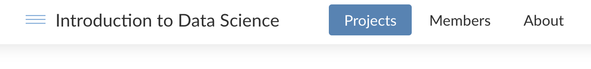
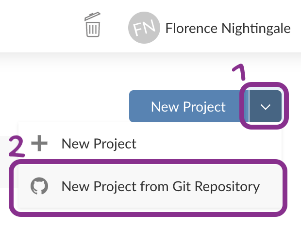
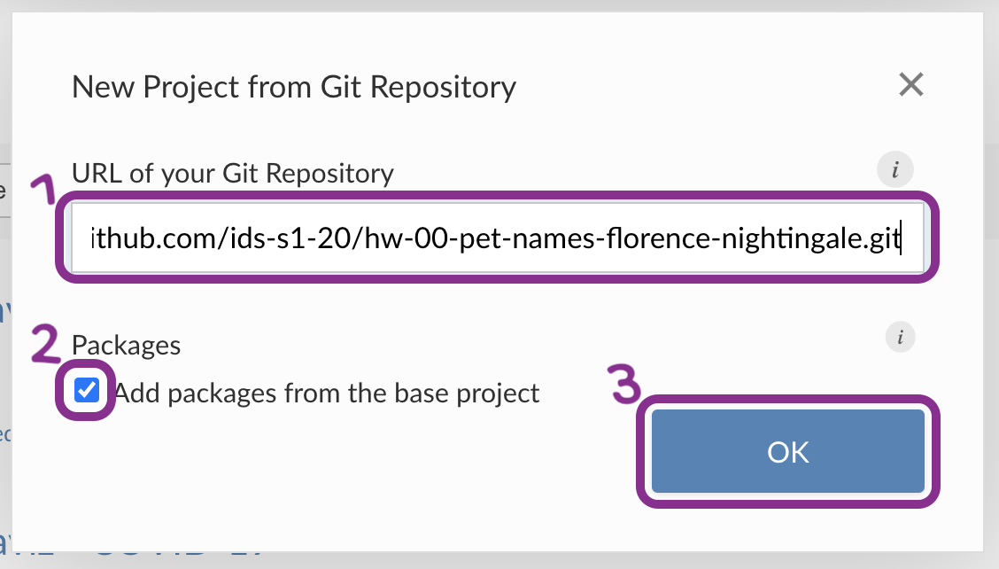

```{r setup, include=FALSE}
library(here)
knitr::opts_chunk$set(
  eval = FALSE,
  out.width = "100%"
  )
```

```{r unsplash, fig.margin = TRUE, echo = FALSE, eval = TRUE, fig.cap = "Photo by Jovana Askrabic on Unsplash"}
knitr::include_graphics("img/jovana-askrabic-XYIQXLH_v0o-unsplash.jpg")
```

## Meet the toolkit

The goal of this assignment is to introduce you to R, RStudio, Git, and GitHub, which you'll be using throughout the course both to learn the data science concepts discussed in the course and to analyze real data and come to informed conclusions.

## Prerequisites

This assignment assumes that you have watched the following videos and completed the lab exercises.
If you haven't yet done so, please pause and complete the following before continuing.

-   Watch the following videos listed [here](https://www.introds.org/post/01-week/#videos "Link to Week 1 videos"):

    -   Meet the toolkit: programming
    -   Meet the toolkit: version control and collaboration

-   [Lab 00: Hello IDS!](https://ids-s1-20.github.io/labs/lab-00/lab-00-hello-ids.html "Lab 00: Hello IDS!")

## Terminology

We've already thrown around a few new terms, so let's define them before we proceed.

-   **R:** Name of the programming language we will be using throughout the course.

-   **RStudio:** An integrated development environment for R.
    In other words, a convenient interface for writing and running R code.

-   **Git:** A version control system.

-   **GitHub:** A web platform for hosting version controlled files and facilitating collaboration among users.

-   **Repository:** A Git repository repository contains all of your project's files and stores each file's revision history.
    It's common to refer to a repository as a repo.

    -   In this course, each assignment you work on will be contained in a Git repo.
    -   For individual assignments, only you will have access to the repo. For team assignments, all team members will have access to a single repo where they work collaboratively.
    -   All repos associated with this course are housed in a GitHub organization: [`ids-s1-20`](https://github.com/ids-s1-20). The organization is set up such that students can only see repos they have access to, but the course staff can see all of them.

## Starting slow

As the course progresses, you are encouraged to explore beyond what the assignments dictate; a willingness to experiment will make you a much better programmer!
Before we get to that stage, however, you need to build some basic fluency in R.
First, we will explore the fundamental building blocks of all of these tools.

## Getting started

Before you can get started with the analysis, you need to make sure you:

-   have a GitHub account

-   are a member of the course GitHub organization

    -   You can check this by going to [`ids-s1-20`](https://github.com/ids-s1-20) and confirming that you can see a repository called `hw-00-pet-names-YOUR_GITHUB_USERNAME` where `YOUR_GITHUB_USERNAME` is, well, your github username.

        ```{r rstudio-cloud, fig.margin = TRUE, echo = FALSE, eval = TRUE}
        knitr::include_graphics("img/rstudio-cloud-space.png")
        ```

-   are a member of the course RStudio Cloud space

    -   You can check this by going to [rstudio.cloud](https://rstudio.cloud/ "RStudio Cloud") and confirming that you can see Introduction to Data Science listed as one of your workspaces on the left menu.

If you failed to confirm any of these, it means you have not yet completed the prerequisites for this assignment.
Please go back to [Prerequisites] and complete them before continuing the assignment.

## Workflow

```{marginfigure}
**IMPORTANT:** If there is no GitHub repo created for you for this assignment, it means I didn't have your GitHub username as of when I assigned the homework. Please let me know your GitHub username asap, and I can create your repo.
```

For each assignment in this course you will start with a GitHub repo that I created for you and that contains the starter documents you will build upon when working on your assignment.
The first step is always to bring these files into RStudio so that you can edit them, run them, view your results, and interpret them.
This action is called **cloning**.

Then you will work in RStudio on the data analysis, making **commits** along the way (snapshots of your changes) and finally **push** all your work back to GitHub.

The next few steps will walk you through the process of getting information of the repo to be cloned, cloning your repo in a new RStudio Cloud project, and getting started with the analysis.

### Step 1. Get URL of repo to be cloned

```{r clone-repo-link, fig.margin = TRUE, echo = FALSE, eval = TRUE}
knitr::include_graphics("img/clone-repo-link.png")
```

On GitHub, click on the green **Code** button, select **HTTPS** (this might already be selected by default, and if it is, you'll see the text *Use Git or checkout with SVN using the web URL* jas in the image on the right).
Click on the clipboard icon 📋 to copy the repo URL.

### Step 2. Go to RStudio Cloud

Go to [rstudio.cloud](https://rstudio.cloud/ "RStudio Cloud") and then **navigate to the course workspace** via the left sidebar.
It's very important that you do this for two reasons:

-   It's only when you're in the course workspace that you'll be able to benefit from R packages I've pre-installed for you so that your project can be configured correctly.
-   It's only when you're in the course workspace that your usage of RStudio Cloud won't count towards their free usage limits. RStudio offers free usage of their Cloud service, but they cap it at 15 hours. The university has already paid for an RStudio Cloud account for you, and you want to make sure you're taking advantage of that, and not using up your personal free hours.

Before you proceed, confirm that you are in the course workspace by checking out what's on your top bar in RStudio Cloud.

```{r course-workspace, fig.fullwidth=TRUE, echo = FALSE, eval = TRUE}

```

### Step 3. Clone the repo

```{r new-project-from-git-1, fig.margin = TRUE, echo = FALSE, eval = TRUE}

```

In RStudio, click on the **down arrow** next to New Project and then choose **New Project from Git Repository**.

```{r new-project-from-git-2, fig.margin = TRUE, echo = FALSE, eval = TRUE}

```

In the pop-up window, **paste the URL** you copied from GitHub, make sure the box for **Add packages from the base project** is checked (it should be, by default) and then click **OK**.

### Step 4. Get working!

Open the R Markdown (Rmd) file called `hw-00-pet-names.Rmd`.

## Hello RStudio!

RStudio is comprised of four panes.

```{r rstudio-anatomy, fig.fullwidth=TRUE, echo = FALSE, eval = TRUE}
knitr::include_graphics("img/rstudio-anatomy.png")
```

-   On the bottom left is the Console, this is where you can write code that will be evaluated. Try typing `2 + 2` here and hit enter, what do you get?
-   On the bottom right is the Files pane, as well as other panes that will come handy as we start our analysis.
-   If you click on a file, it will open in the editor, on the top left pane.
-   Finally, the top right pane shows your Environment. If you define a variable it would show up there. Try typing `x <- 2` in the Console and hit enter, what do you get in the Environment pane? Importantly, this pane is also where the Git interface lives. We will be using that regularly throughout this assignment.

## Warm up

Before we introduce the data, let's warm up with some simple exercises.

```{marginfigure}
The top portion of your R Markdown file (between the three dashed lines) is called **YAML**. It stands for "YAML Ain't Markup Language". It is a human friendly data serialization standard for all programming languages. All you need to know is that this area is called the YAML (we will refer to it as such) and that it contains meta information about your document.
```

### Step 1. Update the YAML

Open the R Markdown (Rmd) file in your project, change the author name to your name, and knit the document.

```{r yaml-raw-to-rendered, fig.fullwidth=TRUE, echo = FALSE, eval = TRUE}
knitr::include_graphics("img/yaml-raw-to-rendered.png")
```

### Step 2: Commit

Then Go to the **Git pane** in your RStudio.

If you have made changes to your Rmd file, you should see it listed here.
Click on it to select it in this list and then click on **Diff**.
This shows you the **diff**erence between the last committed state of the document and its current state that includes your changes.
If you're happy with these changes, write *"Update author name"* in the **Commit message** box and hit **Commit**.

```{r update-author-name-commit, fig.fullwidth = TRUE, echo = FALSE, eval = TRUE}
knitr::include_graphics("img/update-author-name-commit.png")
```

You don't have to commit after every change, this would get quite cumbersome.
You should consider committing states that are *meaningful to you* for inspection, comparison, or restoration.
In the first few assignments we will tell you exactly when to commit and in some cases, what commit message to use.
As the semester progresses we will let you make these decisions.

### Step 3. Push

Now that you have made an update and committed this change, it's time to push these changes to the web!
Or more specifically, to your repo on GitHub.
Why?
So that others can see your changes.
And by others, we mean the course teaching team (your repos in this course are private to you and us, only).

In order to push your changes to GitHub, click on **Push**.
This will prompt a dialogue box where you first need to enter your user name, and then your password.
This might feel cumbersome.
Bear with me... We *will* teach you how to save your password so you don't have to enter it every time.
But for this one assignment you'll have to manually enter each time you push in order to gain some experience with it.

### Thought exercise

Which of the above steps (updating the YAML, committing, and pushing) needs to talk to GitHub?[^1]

[^1]: Only pushing requires talking to GitHub, this is why you're asked for your password at that point.

## Packages

R is an open-source language, and developers contribute functionality to R via packages.
In this assignment we will use the following packages:

-   `tidyverse`: a collection of packages for doing data analysis in a "tidy" way
-   `openintro`: a package that contains the datasets from OpenIntro books

We use the `library()` function to load packages.
In your R Markdown document you should see an R chunk labelled `load-packages` which has the necessary code for loading both packages.
You should also load these packages in your Console, which you can do by sending the code to your Console by clicking on the **Run Current Chunk** icon (green arrow pointing right icon).

```{r}
library(tidyverse)
library(openintro)
```

Note that these packages are also get loaded in your R Markdown environment when you **Knit** your R Markdown document.

## Data

The city of [Seattle, WA](https://en.wikipedia.org/wiki/Seattle) has an open data portal that includes pets registered in the city.
For each registered pet, we have information on the pet's name and species.
The data used in this exercise can be found in the **openintro** package, and it's called `seattlepets`.
You can find out more about the dataset by inspecting its documentation (which contains a **data dictionary**, name of each variable and its description), which you can access by running `?seattlepets` in the Console or using the Help menu in RStudio to search for `seattlepets`.

1.  According to the data dictionary, how many pets are included in this dataset?

2.  Again, according to the data dictionary, how many variables do we have for each pet?

3.  

The following visualization plots the proportion of dogs with a given name versus the proportion of cats with the same name.
The 20 most common cat and dog names are displayed.
The diagonal line on the plot is the x=yx=y line; if a name appeared on this line, the name's popularity would be exactly the same for dogs and cats.

The data for this assignment come from [TidyTuesday](https://github.com/rfordatascience/tidytuesday/blob/master/data/2020/2020-09-22/readme.md) -- this is the same dataset we used in the code along session for the week.
TidyTuesday is a weekly social data project for the R community.
Read more about TidyTuesday [here](https://github.com/rfordatascience/tidytuesday) and see people's contributions on Twitter under the [\#tidytuesday hashtag](https://twitter.com/search?q=tidytuesday&src=typed_query).

Recent development in Edinburgh regarding the growth of Airbnb and its impact on the housing market means a better understanding of the Airbnb listings is needed.
Using data provided by Airbnb, we can explore how Airbnb availability and prices vary by neighborhood.

The data come from the [Kaggle database](https://www.kaggle.com/thoroc/edinburgh-inside-airbnb/version/2).
It's been modified to better serve the goals of this exploration.

## Learning goals

The goal of this assignment is not to conduct a thorough analysis of Airbnb listings in Edinburgh, but instead to give you another chance to practice your workflow, data visualization, and interpretation skills.

## Getting help

If you have any questions about the assignment, please post them on Piazza!

## Getting started

```{marginfigure}
**IMPORTANT:** If there is no GitHub repo created for you for this assignment, it means I didn't have your GitHub username as of when I assigned the homework. Please let me know your GitHub username asap, and I can create your repo.
```

Go to the course [GitHub organization](https://github.com/ids-s1-19) and locate your HW 1 repo, which should be named `hw-01-airbnb-edi-YOUR_GITHUB_USERNAME`.
Grab the URL of the repo, and clone it in RStudio.
Refer to [Lab 01](/labs/lab-01/lab-01-hello-r) if you would like to see step-by-step instructions for cloning a repo into an RStudio project.

First, open the R Markdown document `hw-01-airbnb-edi.Rmd` and Knit it.
Make sure it compiles without errors.
The output will be in the file markdown `.md` file with the same name.

## Packages

We'll use the **tidyverse** package for this analysis.
Run the following code in the Console to load this package.

```{r load-packages, message=FALSE}
library(tidyverse)
```

## Data

The data is in a CSV (comma separated values) file called `listings.csv` in the `data/` folder in your repository.
You can load this file into R using the `read_csv()` function.

```{r include=FALSE}
listings <- read_csv(here::here("csv/listings.csv"))
```

```{r eval=FALSE}
listings <- read_csv("data/listings.csv")
```

1.  Load the data in the Console with the code above, and observe that an object called `listings` has been added to your environment (in the Environment tab) in the top right. Click on this object to view the data in the data viewer. What does each row in the dataset represent?

```{marginfigure}
**Hint:** The Markdown Quick Reference sheet has an example of inline R code that might be helpful. You can access it from the Help menu in RStudio.
```

2.  How many observations (rows) does the dataset have? Instead of hard coding the number in your answer, use inline code.

`r emo::ji("white_check_mark")` `r emo::ji("arrow_up")` *Now is a good time to commit and push your changes to GitHub with an appropriate commit message. Make sure to commit and push all changed files so that your Git pane is cleared up afterwards.*

Each column represents a variable.
We can get a list of the variables in the data frame using the `names()` function.

```{r}
names(listings)
```

The variables and their descriptions are given below:

-   `id`: ID number of the listing
-   `price`: Price, in GBP, for one night stay
-   `neighbourhood`: Neighbourhood listing is located in
-   `accommodates`: Number of people listing accomodates
-   `bathrooms`: Number of bathrooms
-   `bedrooms`: Number of bedrooms
-   `beds`: Number of beds (which can be different than the number of bedrooms)
-   `review_scores_rating`: Average rating of property
-   `number_of_reviews`: Number of reviews
-   `listing_url`: Listing URL

```{marginfigure}
**Note:** The plot will give a warning about some observations with non-finite values for price being removed. Don't worry about the warning, it simply means that 199 listings in the data didn't have prices available, so they can't be plotted.
```

3.  Create a faceted histogram where each facet represents a neighborhood and displays the distribution of Airbnb prices in that neighborhood. Sample code is provided below, but you will need to fill in the blanks.

```{r eval=FALSE}
ggplot(data = ___, mapping = aes(x = ___)) +
  geom_histogram(binwidth = ___) +
  facet_wrap(~___)
```

Let's desconstruct this code:

-   `ggplot()` is the function we are using to build our plot, in layers.
-   In the first layer we always define the data frame as the first argument. Then, we define the mappings between the variables in the dataset and the **aes**thetics of the plot (e.g. x and y coordinates, colors, etc.).
-   In the next layer we represent the data with **geom**etric shapes, in this case with a histogram. You should decide what makes a reasonable bin width for the histogram by trying out a few options.
-   In the final layer we facet the data by neighbourhood.

`r emo::ji("white_check_mark")` `r emo::ji("arrow_up")` *Commit and push your changes again.*

4.  Create a similar visualization, this time showing the distribution of review scores (`review_scores_rating`) across neighborhoods. In your answer, include a brief interpretation of how Airbnb guests rate properties in general and how the neighborhoods compare to each other in terms of their ratings.

`r emo::ji("white_check_mark")` `r emo::ji("arrow_up")` *Commit and push your changes again.*
